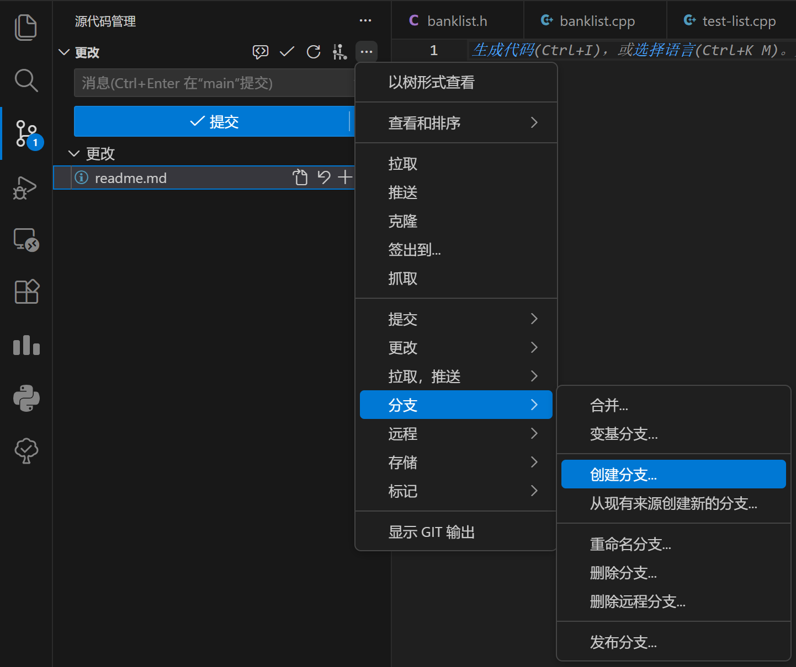
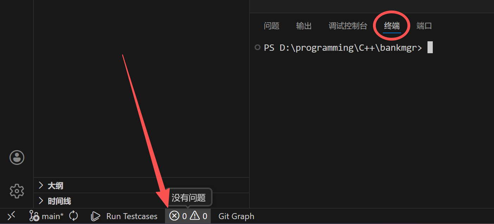
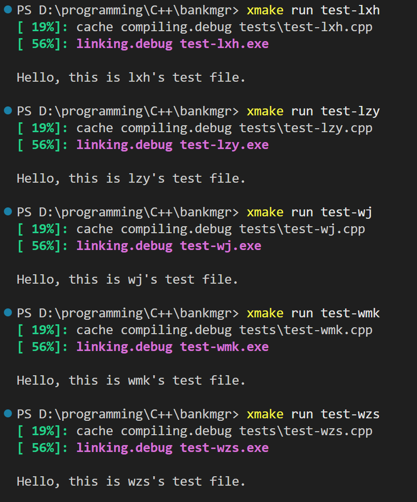
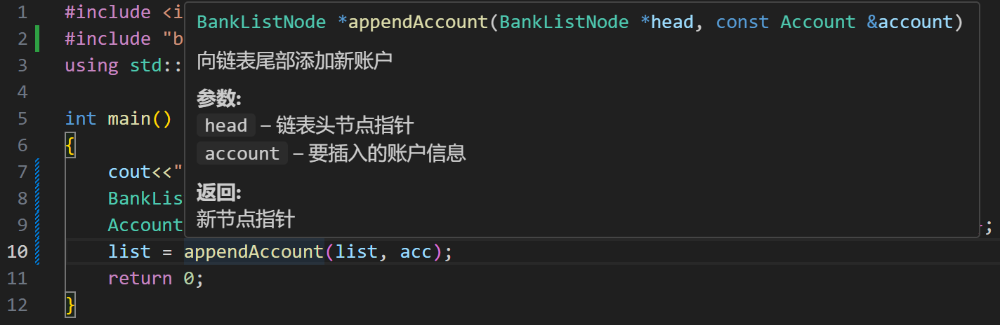

# 一、配置环境

## 1. 安装 MinGW (MSYS2)

1.  下载 MinGW 安装程序：[MSYS2](https://github.com/msys2/msys2-installer/releases/download/2025-12-13/msys2-x86_64-20251213.exe)
2.  运行安装程序，安装路径建议保持默认 (`C:\msys64`)。
3.  安装完成后，勾选 "Run MSYS2 now" 或在开始菜单搜索并打开 **MSYS2 UCRT64** 终端。

## 2. 安装 GCC 工具链

在 **MSYS2 UCRT64** 终端中输入以下命令并回车（遇到询问直接回车确认）：

```bash
pacman -S mingw-w64-ucrt-x86_64-gcc mingw-w64-ucrt-x86_64-gdb mingw-w64-ucrt-x86_64-make
```

## 3. 安装 xmake

如果尚未安装 xmake，请在 PowerShell (管理员) 中运行：

```powershell
irm https://xmake.io/psget.text | iex
```

## 4. 安装Git
1. 下载 Git 安装程序：[Git for Windows](https://github.com/git-for-windows/git/releases/download/v2.52.0.windows.1/Git-2.52.0-64-bit.exe)
2. 运行安装程序，保持默认选项，直到安装完成。
   
## 5.安装VS Code
1. 下载 VS Code 安装程序：[Visual Studio Code](https://code.visualstudio.com/Download)
2. 运行安装程序，保持默认选项，直到安装完成。
3. 打开 VS Code，安装扩展：
    - Chinese(Simplified) (简体中文) Language Pack for Visual Studio Code
    - C/C++ Extension Pack
    - Git Graph
    - Gtihub 拉取请求
    - Markdown All in One
  
    安装完成后重启VS Code。
4. 配置 VS Code 以使用 MinGW 工具链：
    - 打开 VS Code 设置（左下角）
    - 搜索 "C_Cpp.default.compilerPath"，打开配置文件
    - 设置为 `C:\\msys64\\ucrt64\\bin\\gcc.exe`
    - 搜索 "C_Cpp.default.intelliSenseMode"
    - 设置为 `windows-gcc-x64`
  
## 6. 克隆仓库与配置项目

打开 PowerShell 或 VS Code 终端：


### 1. 克隆仓库
```powershell
git clone https://github.com/TeacherLi07/bankmgr
cd bankmgr
```
### 2. 配置 xmake 使用 MinGW 环境
```powershell
xmake f -p mingw --sdk=C:\msys64\ucrt64 -c -m debug
```
### 3. 配置分支（仅需在首次使用时执行）


VS Code左侧侧边栏->源代码管理->分支->创建分支->以你的名字缩写命名->按回车

---

# 二、撰写代码

## 文件组织
- `src/`：源代码文件夹，包含所有的 `.cpp` 和 `.h` 文件。
  
  此文件夹下仅有一个`main.cpp`文件，只有这个文件中有`main`函数，是整个银行系统的`main`函数。

- `tests/`：测试代码文件夹，包含测试相关的代码。

  此文件夹下的每个`test-<your-name>.cpp`文件中都有一个`main`函数，是用于测试的`main`函数。其中，`<your-name>`替换为你的名字缩写。
  所以`tests/`的具体文件组织如下：
  ```
  tests/
      ├── test-lxh.cpp   
      ├── test-lzy.cpp     
      ├── test-wj.cpp     
      ├── test-wmk.cpp     
      └── test-wzs.cpp 
    ```
  如果希望测试自己写的功能，请在`tests/test-<your-name>.cpp`中编写`main`函数，而非修改`src/main.cpp`。

## 编译与运行
打开VS Code底栏，切换到终端选项卡：

键入命令:
```powershell
xmake run test-<your-name>
```
其中`<your-name>`替换为你的名字缩写。

这行命令会以`tests/test-<your-name>.cpp`作为入口文件编译并运行程序。
不同的`<your-name>`会运行不同的测试程序，效果如图：


## 代码形式
函数声明与定义分离，头文件`.h`中为函数声明，同名源文件`.cpp`中为函数定义。

.cpp文件中包含对应的.h文件，例如`banklist.cpp`中
```cpp
#include "banklist.h"
```
注意非系统头文件使用双引号包含。

在测试文件中使用函数时，需要包含对应的头文件，例如使用了`banklist.h`中的函数，就需要：
```cpp
#include "banklist.h"
```

可以参考已有的`banklist.h`，`banklist.cpp`与`tests\test-lxh.cpp`。

---
函数声明上应有注释说明其功能与参数。这是为了VS Code的智能提示功能能够正常工作。

e.g.
```cpp
/**
 * @brief 向链表尾部添加新账户
 * @param head 链表头节点指针
 * @param account 要插入的账户信息
 * @return 新节点指针
 */
BankListNode *appendAccount(BankListNode *head, const Account &account);
```
可以看到，使用此函数时，如果把鼠标放在函数上，就可以看到详细的说明：

这些说明就是注释提供的。

---

代码中不建议使用万能头文件`#include <bits/stdc++.h>`，和使用`using namespace std;`，以避免命名冲突与编译问题。

应当按照所需功能引入头文件，并使用`using std::xxx;`单独引入所需的命名空间成员，例如：
```cpp
#include <string>
using std::string;

int main() {
    string name = "Bank Manager";
    return 0;
}
```
即可正常使用。